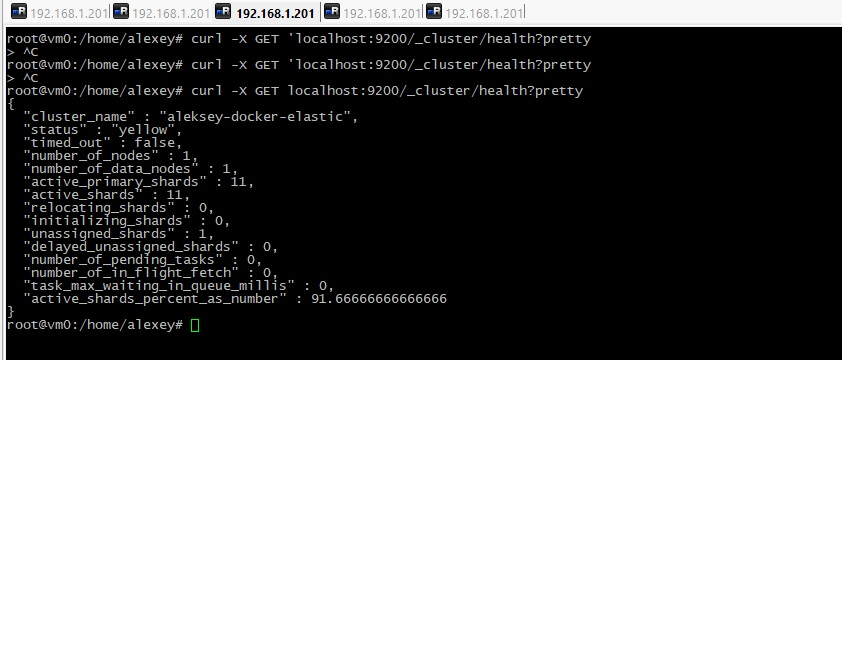
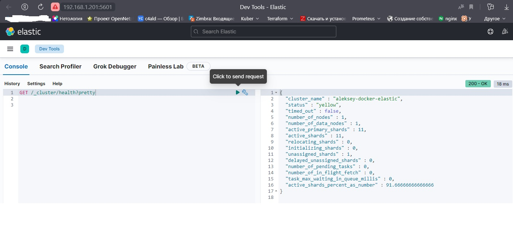
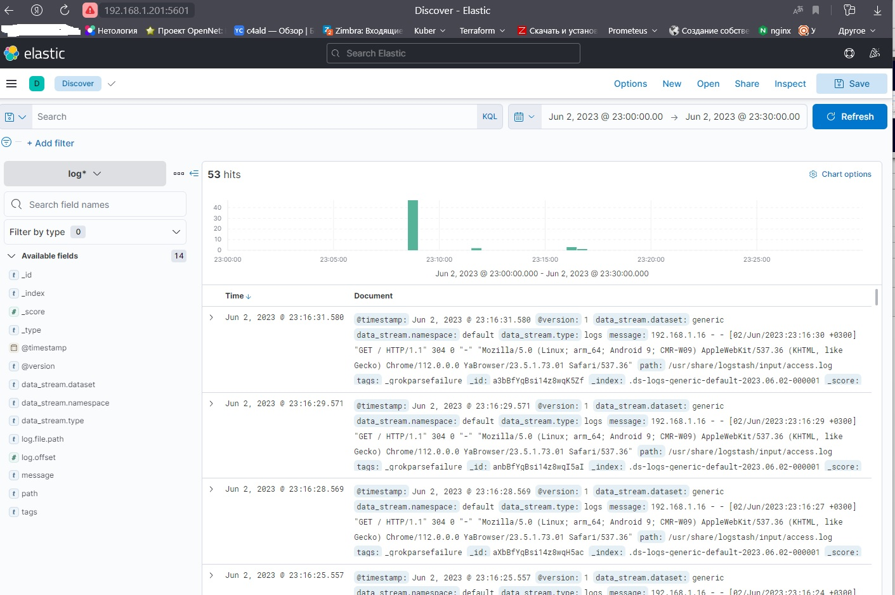
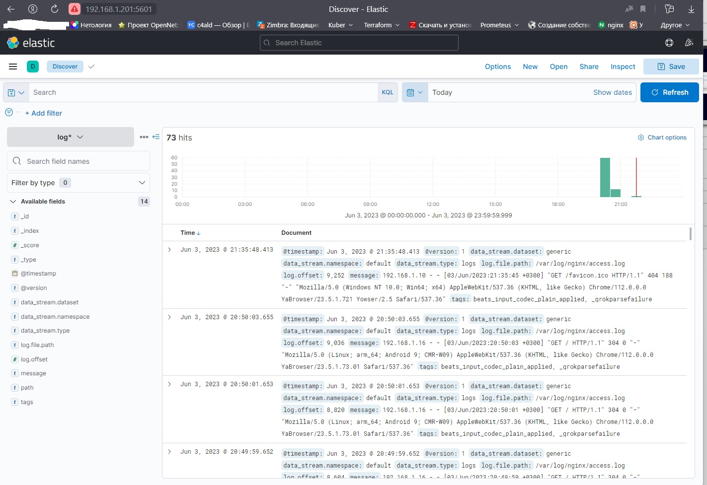

# Домашнее задание к занятию "`«ELK»`" - `Дьяконов Алексей`

### Задание 1. Установите и запустите Elasticsearch, после чего поменяйте параметр cluster_name на случайный.

` ELK был развернут с помощью следующего docker-compose:`

[docker-compose.yml](./docker/docker-compose.yml)

-

### Задание 2.Установите и запустите Kibana.

-

### Задание 3.Установите и запустите Logstash и Nginx. С помощью Logstash отправьте access-лог Nginx в Elasticsearch.

[logstash.yml](./logstash/logstash.yml)
[my.conf](./logstash/my.conf)

-

### Задание 4.Установите и запустите Filebeat. Переключите поставку логов Nginx с Logstash на Filebeat.

[logstash.yml](./filebeat/logstash.yml)
[my.conf](./filebeat/my.conf)
[filebeat.yml](./filebeat/filebeat.yml)

-